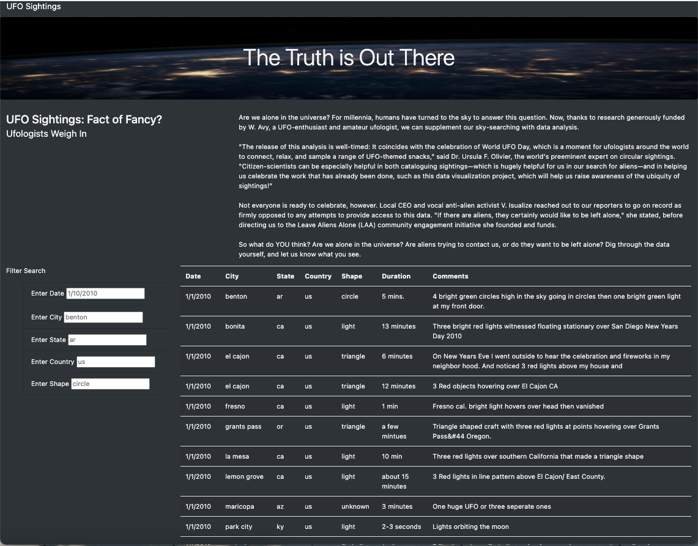
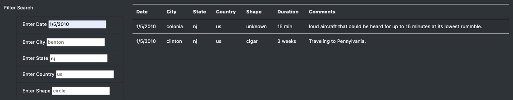
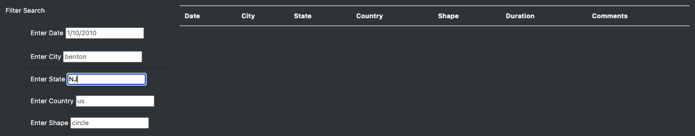

# UFOs

### Overview of project:

For this project we helped Dana take data and create a visually aesthetic and user-friendly HTML page.  We wanted to add customization and attention-grabbing elements to the page by adding images, and multiple filters.

### Results: 

The results of the HTML page where just what Dana was looking for, as we were able to incorporate all of the elements she was looking for on her page. We uploaded data in the form of a JavaScript file and loaded it to Visual Studio Code in order to be able to loop through it. The data was structured much like a Python list but arranged a little differently. With the data we had available we were able to construct a table and categorize it based on a key-value system. We created a filter that allows the user to parse through the data using either one or multiple filters at the same time allowing them to narrow their search even further. We gave the user the ability to search thorough five different parameters at the same time. Here is an example of what the page looks like when it is first loaded:

Users have the ability to search using any combination of the following:
  - "Enter Date"
  - "Enter City"
  - "Enter State"
  - "Enter Country"
  - "Enter Shape"
 
This allows them to narrow their seaches down to exactly the criteria they want. Here is an example of how to parse through the data using the search parameters we created for the site. As you can see I have selected a date of “1/5/2010, a state of “NJ’ and there were 2 instances that matched our criteria. 

### Summary:

While we were able to create the HTML page that Dana was looking for there were some drawbacks specifically with the data that she provided. There were a lot of misspelling when parsing through the data and there is the instance of capitalization. As I attempted to search states using capital letters the search returned nothing since the code was written to match EXACTLY what the user is searching.  We need to have clean data or perhaps change our code to modify the data and return the data back as clean as possible. 

### Recommendations:

  - To improve the accuracy of the search criteria and not have users frustrated because they are not getting any data back get more accurate data that has been cleaned and formatted equally. Here I serached for the state of New Jersey using "NJ" and it returned no result but if I changed it to lowercase "nj" I would have gotten results back. 
 
 
 
  - There is a need for more data to create a better search experience for the user. At the moment there is only about 10 weeks’ worth of data and it is only limited to the United States. Collecting more data to navigate through would make the experience more welcoming for the user. 

